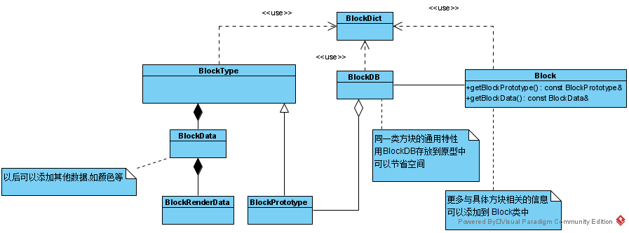
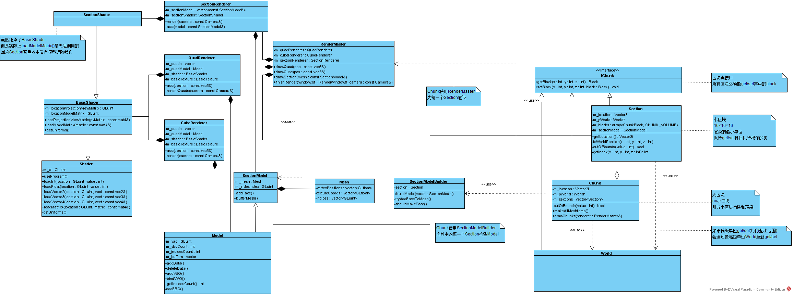

# 渲染世界

## 1. 分析基本框架


## 2. 渲染世界

### 2.1 修改相关类的命令

首先,Hopson对于关于渲染世界相关的类的命名属实乱七八糟,进行一点修改  

1. 把 ChunkSection 类改为 Section  
2. 把 BlockDataHolder 改为 BlockRenderData  
3. 把 BlockDataBase 改为 BlockDB(BlockDataBase容易误解为BlockData的基类)
4. 把 BlockId 改为 BlockDict(BlockId容易被误解为是一种数据类型,而非索引字典)
5. 把 ChunkBlock 改为 Block
6. 把 ChunkMesh 改为 SectionModel
7. 把 ChunkMeshBuilder 改为 SectionModelBuilder

### 2.2 使用 Mesh 封装原本的渲染信息

构建 Mesh 结构体,并在 Model 类中使用其代替原本的传参方式  
然后再 Renderer 中修改使用 Model 的方法

### 2.3 构建 Block 类及其依赖基类

构造顺序:  
(BlockRenderData) -> (BlockData) -> (BlockType) -> (Block) ->(BlockDB)
                                                  (BlockDict) --↑



### 2.4 构建区块系统的渲染部分



1. 构造两个新的着色器  
    SectionFragment.glsl 和 SectionVertex.glsl 用来渲染小区块的模型  
    和 BasicXXXX.gls 的区别就是去掉了Model Matrix...

2. 构造新的 Shader 类
3. 构造新的 Renderer 类(声明SectionModel并继承Model类)
4. 修改 RendererMaster 类
5. 补充完毕 SectionModel 类

### 2.5 构建区块类

1. 构建 SectionModelBuilder
2. 构建 IChunk 接口及其实现子类

### 2.6 构建世界类

构建 World 类

### 2.7 调试

#### 2.7.1 bug1

```text
f:\lang\c++\mingw\lib\gcc\mingw32\9.2.0\include\c++\bits\stl_construct.h: In instantiation of 'void std::_Construct(_T1*, _Args&& ...) [with _T1 = Section; _Args = {Section}]':
f:\lang\c++\mingw\lib\gcc\mingw32\9.2.0\include\c++\bits\stl_uninitialized.h:83:18:   required from 'static _ForwardIterator std::__uninitialized_copy<_TrivialValueTypes>::__uninit_copy(_InputIterator, _InputIterator, _ForwardIterator) [with _InputIterator = std::move_iterator<Section*>; _ForwardIterator = Section*; bool _TrivialValueTypes = false]'
f:\lang\c++\mingw\lib\gcc\mingw32\9.2.0\include\c++\bits\stl_uninitialized.h:134:15:   required from '_ForwardIterator std::uninitialized_copy(_InputIterator, _InputIterator, _ForwardIterator) [with _InputIterator = std::move_iterator<Section*>; _ForwardIterator = Section*]'
f:\lang\c++\mingw\lib\gcc\mingw32\9.2.0\include\c++\bits\stl_uninitialized.h:289:37:   required from '_ForwardIterator std::__uninitialized_copy_a(_InputIterator, _InputIterator, _ForwardIterator, std::allocator<_Tp>&) [with _InputIterator = std::move_iterator<Section*>; _ForwardIterator = Section*; _Tp = Section]'
f:\lang\c++\mingw\lib\gcc\mingw32\9.2.0\include\c++\bits\stl_uninitialized.h:311:2:   required from '_ForwardIterator std::__uninitialized_move_if_noexcept_a(_InputIterator, _InputIterator, _ForwardIterator, _Allocator&) [with _InputIterator = Section*; _ForwardIterator = Section*; _Allocator = std::allocator<Section>]'
f:\lang\c++\mingw\lib\gcc\mingw32\9.2.0\include\c++\bits\vector.tcc:474:3:   required from 'void std::vector<_Tp, _Alloc>::_M_realloc_insert(std::vector<_Tp, _Alloc>::iterator, _Args&& ...) [with _Args = {sf::Vector3<int>, World&}; _Tp = Section; _Alloc = std::allocator<Section>; std::vector<_Tp, _Alloc>::iterator = __gnu_cxx::__normal_iterator<Section*, std::vector<Section> >; typename std::_Vector_base<_Tp, _Alloc>::pointer = Section*]'
f:\lang\c++\mingw\lib\gcc\mingw32\9.2.0\include\c++\bits\vector.tcc:121:4:   required from 'void std::vector<_Tp, _Alloc>::emplace_back(_Args&& ...) [with _Args = {sf::Vector3<int>, World&}; _Tp = Section; _Alloc = std::allocator<Section>]'
F:\Code\code\courses\opengl\minecraft-challenge\MineCraft-Yishiyu-Edition\src\World\Chunk\Chunk.cpp:12:79:   required from here
f:\lang\c++\mingw\lib\gcc\mingw32\9.2.0\include\c++\bits\stl_construct.h:75:7: error: use of deleted function 'Section::Section(Section&&)'
   75 |     { ::new(static_cast<void*>(__p)) _T1(std::forward<_Args>(__args)...); }
      |       ^~~~~~~~~~~~~~~~~~~~~~~~~~~~~~~~~~~~~~~~~~~~~~~~~~~~~~~~~~~~~~~~~~
In file included from F:\Code\code\courses\opengl\minecraft-challenge\MineCraft-Yishiyu-Edition\src\World\Chunk\Chunk.h:9,
                 from F:\Code\code\courses\opengl\minecraft-challenge\MineCraft-Yishiyu-Edition\src\World\Chunk\Chunk.cpp:5:
F:\Code\code\courses\opengl\minecraft-challenge\MineCraft-Yishiyu-Edition\src\World\Chunk\Section.h:17:7: note: 'Section::Section(Section&&)' is implicitly deleted because the default definition would be ill-formed:
   17 | class Section : public IChunk {
      |       ^~~~~~~
F:\Code\code\courses\opengl\minecraft-challenge\MineCraft-Yishiyu-Edition\src\World\Chunk\Section.h:17:7: error: use of deleted function 'SectionModel::SectionModel(SectionModel&&)'
In file included from F:\Code\code\courses\opengl\minecraft-challenge\MineCraft-Yishiyu-Edition\src\World\Chunk\Section.h:10,
                 from F:\Code\code\courses\opengl\minecraft-challenge\MineCraft-Yishiyu-Edition\src\World\Chunk\Chunk.h:9,
                 from F:\Code\code\courses\opengl\minecraft-challenge\MineCraft-Yishiyu-Edition\src\World\Chunk\Chunk.cpp:5:
F:/Code/code/courses/opengl/minecraft-challenge/MineCraft-Yishiyu-Edition/src/Model/SectionModel.h:12:7: note: 'SectionModel::SectionModel(SectionModel&&)' is implicitly deleted because the default definition would be ill-formed:
   12 | class SectionModel : public Model {
      |       ^~~~~~~~~~~~
F:/Code/code/courses/opengl/minecraft-challenge/MineCraft-Yishiyu-Edition/src/Model/SectionModel.h:12:7: error: use of deleted function 'Model::Model(const Model&)'
In file included from F:/Code/code/courses/opengl/minecraft-challenge/MineCraft-Yishiyu-Edition/src/Model/SectionModel.h:8,
                 from F:\Code\code\courses\opengl\minecraft-challenge\MineCraft-Yishiyu-Edition\src\World\Chunk\Section.h:10,
                 from F:\Code\code\courses\opengl\minecraft-challenge\MineCraft-Yishiyu-Edition\src\World\Chunk\Chunk.h:9,
                 from F:\Code\code\courses\opengl\minecraft-challenge\MineCraft-Yishiyu-Edition\src\World\Chunk\Chunk.cpp:5:
F:/Code/code/courses/opengl/minecraft-challenge/MineCraft-Yishiyu-Edition/src/Model/Model.h:20:7: note: 'Model::Model(const Model&)' is implicitly deleted because the default definition would be ill-formed:
   20 | class Model : public NonCopyable {
      |       ^~~~~
```

void emplace_back( Args&&... args );需要被保证容器内元素满足`MoveInsertable and EmplaceConstructible`要求  
也就是需要一个移动构造函数或者拷贝构造函数,都没有的时候编译器会实现一个默认的移动构造函数  
SectionModel 继承自 Model 实现了 NonCopyable 接口,无法拷贝  
八成是编译器实现的移动构造函数对 SectionModel 进行了拷贝操作  
手动实现一个正确的版本即可(包括所涉及到的类)


注释了所有引起`warning: '-pedantic' is not an option that controls warnings [-Wpragmas]`的内容

