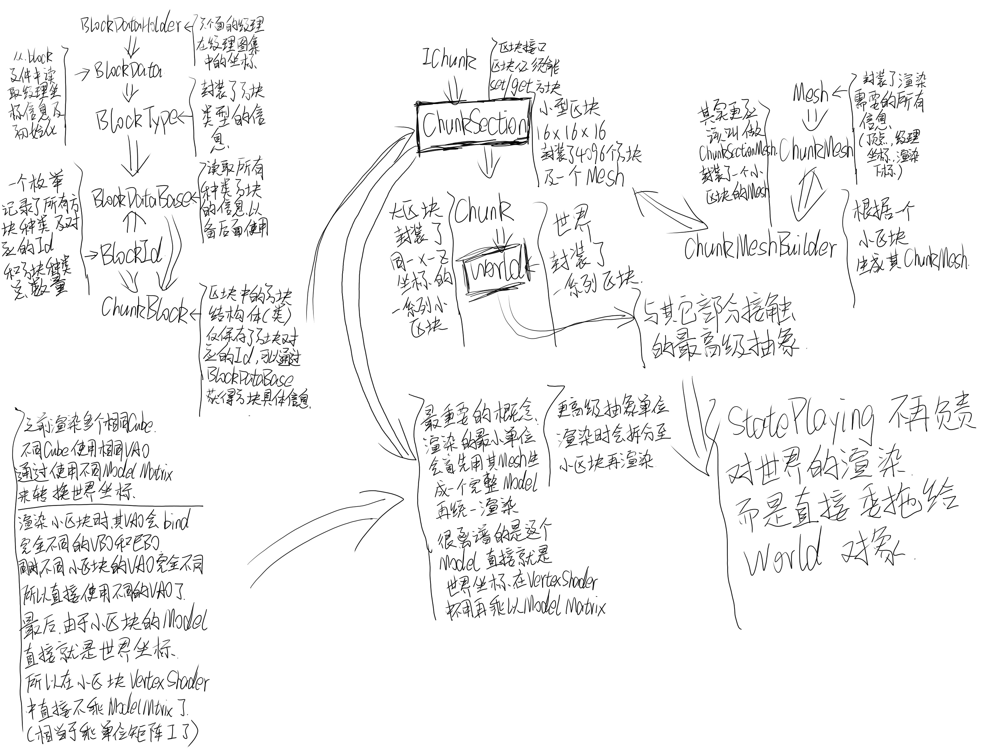

# 渲染世界

## 1. 分析基本框架

## 2. 渲染世界

### 2.1 修改相关类的命令

首先,Hopson对于关于渲染世界相关的类的命名属实乱七八糟,进行一点修改  

1. 把 ChunkSection 类改为 Section  
2. 把 BlockDataHolder 改为 BlockRenderData  
3. 把 BlockDataBase 改为 BlockDB(BlockDataBase容易误解为BlockData的基类)
4. 把 BlockId 改为 BlockDict(BlockId容易被误解为是一种数据类型,而非索引字典)
5. 把 ChunkBlock 改为 Block
6. 把 ChunkMesh 改为 SectionMesh
7. 把 ChunkMeshBuilder 改为 SectionMeshBuilder

### 2.2 使用 Mesh 封装原本的渲染信息

构建 Mesh 结构体,并在 Model 类中使用其代替原本的传参方式  
然后再 Renderer 中修改使用 Model 的方法

